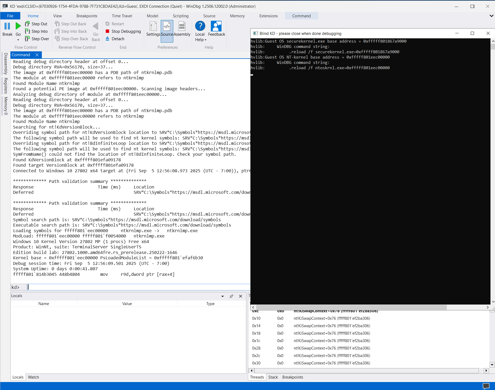
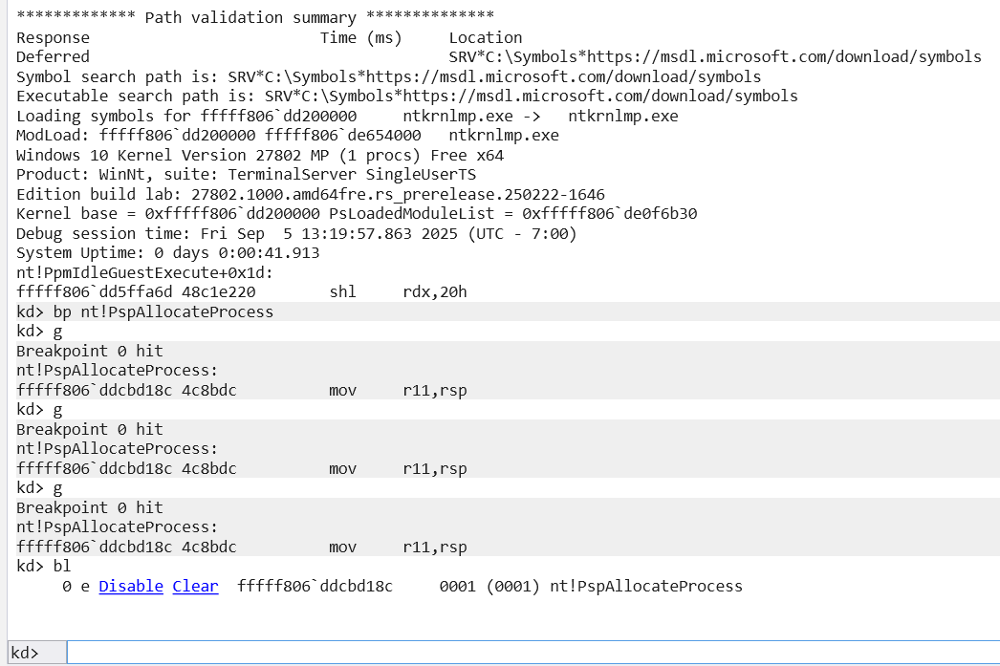

# Hyper-V live debugging

[Actual distributive](https://github.com/gerhart01/LiveCloudKd/releases/download/v1.0.22021109/LiveCloudKd.EXDi.debugger.v1.0.22021109.zip)

Documentation for new debugger build. Actual distributive will be shared, after good protector will be found for it (yes, free software must be protected too, as Microsoft showed (https://x.com/gerhart_x/status/1915104209948791211) - it is strange. Why need to do that?).

Documentation for older releases you can read at: https://github.com/gerhart01/LiveCloudKd/blob/64ba7a128e303509b4c548a5167a624ae7afbfa9/ExdiKdSample/LiveDebugging.md

WinDBG - early WInDBG with modern UI, that can be downloaded from Windows Store
WinDBG (Classic) - WinDBG, that included in Windows WDK or SDK

LiveCloudKd EXDI debugger can be used for debugging Hyper-V guest OS kernel including securekernel without enabling kernel debugging in Windows bootloader with VBS and HVCI enabled.

Working with guest Windows Server 2022, 2025 and Windows 11, including preview builds (on September 2025)

For debugging you can use Windows Server 2022, 2025 (including Insider Preview and Evaluation Edition) or Windows 11 (including Insider Preview) as host OS. I still recommend to use Windows Server version, because it more stable for debugging.

It is good to use VMware Workstation for it, but you can try use Hyper-V with Windows Server 2019 as guest OS and debugged OS as nested guest OS.
For Windows 11 you need to change Hyper-V scheduler to Classic

```
  bcdedit /set hypervisorschedulertype Classic
```

You can see current type of scheduler using command (https://learn.microsoft.com/en-us/windows-server/virtualization/hyper-v/manage/manage-hyper-v-scheduler-types).
Current scheduler type must be 1 or 2.

```
Get-WinEvent -FilterHashTable @{ProviderName="Microsoft-Windows-Hyper-V-Hypervisor"; ID=2} -MaxEvents 1
```

Also for guest OS disable dynamic memory

# VSM\VBS activating for Secure Kernel debugging

First read official Microsoft document [Enable virtualization-based protection or code integrity](https://learn.microsoft.com/en-us/windows/security/hardware-security/enable-virtualization-based-protection-of-code-integrity)

It was enough to enable VBS in group policy editor, but you can enable additional options for explore it (for example, Kernel-mode Hardware-enforced Stack Protection)

For guest VM don't forget enable Secure Boot and Trusted Platform Module (for Windows 11). 

# Installation

EXDI is used for integration custom debugging engines with WinDBG.

1. Extract all debugger files to WinDBG (Classic) install directory (installer can be found in Windows SDK 11 24H2)
2. Install Visual Studio 2022 runtime libraries - https://aka.ms/vs/17/release/vc_redist.x64.exe 
3. Register ExdiKdSample.dll using
   ```
   regsvr32.exe /i ExdiKdSample.dll
   ```
   command
4. Configure symbols path for WinDBG:

```
$folder = "C:\Symbols"
$symbol_path = "SRV*$folder*https://msdl.microsoft.com/download/symbols"

New-Item -Type Directory $folder
compact /c /i /q /s:$folder

[Environment]::SetEnvironmentVariable("_NT_SYMBOL_PATH",$symbol_path,"Machine")
```

# Start

1. Set "VSMScan"=dword:00000001 for securekernel.exe scanning or "VSMScan"=dword:00000000 for ntoskrnl debugging (if it is needed) using RegParam.reg file in debugger distributive.
2. Start LiveCloudKd with EXDI plugin: 

```
LiveCloudKd /l /a 0 /n 0
```
a - Action ID (Live kernel debugger)
n - ID of virtual machine (standard is zero, if you run VM. Useful for restarting)

It automatically launches WinDBG with EXDI plugin in live debugging mode.

3. You can use WinDBG and see events in separate logging window:



4. Also you can directly start WinDBG (classic) using command

```
windbg.exe -d -v -kx exdi:CLSID={67030926-1754-4FDA-9788-7F731CBDAE42},Kd=Guess
```

but before you need create registry key HKEY_LOCAL_MACHINE\SOFTWARE\LiveCloudKd\Parameters\VmId, type REG_DWORD and enter VM position number in LiveCloudKd list [0, 1, 2, ...]. You can see that list, if you launch LiveCloudKd without parameters. If you launch 1 VM, that parameter will be 0.

5. Now you can start WinDBG, then go to File -> Start debugging -> Attach to Kernel, open EXDI tab and paste string 

```
CLSID={67030926-1754-4FDA-9788-7F731CBDAE42},Kd=Guess
```
or for WinDBG with modern UI:

```
DbgX.Shell.exe -v -kx exdi:CLSID={67030926-1754-4FDA-9788-7F731CBDAE42},Kd=Guess
```
or
```
.\DbgX.Shell.exe -v -kx "exdi:CLSID={67030926-1754-4FDA-9788-7F731CBDAE42},Kd=Guess"
```
or for OS with installed version of WinDBG
```
windbgx -v -kx "exdi:CLSID={67030926-1754-4FDA-9788-7F731CBDAE42},Kd=Guess"
```


# Live debugging usage

1 CPU for guest OS for live debugging is preferable and Dynamic memory option must be disabled.
Experimented multi-CPU debugging was added. For successful debugging you need set Debug -> Event Filters -> Break instruction exception to Handle -> Not Handle, and Execution -> Output inside WinDBG. 

Set breakpoint using "bp" command, press "Run", wait until breakpoint was triggered. You can set 0x1000 breakpoints now. It is software like breakpoints and they are not limited. 
Also you can use single step command.

For debugging Windows Secure Kernel:

1. See securekernel.exe base address in logging output window
2. Execute command in WinDBG:

```
.reload /f securekernel.exe=<securekernel_base_address>
```

3. Make breakpoint (you need enter Windows Secure Kernel context)

```
bp securekernel!SkCallNormalMode or 
bp securekernel!IumInvokeSecureService
```

1. After bp was triggered, execute .reload command. In WinDBG you need press Ctrl+Alt+V for enabling verbose mode (you can't to enable it from cmd line - Dbg.Shell.X doesn't get additional parameters, when it launching in EXDI mode).
Search images load addresses in pattern:

```
The image at <module_base_address> is securekernel.exe
The image at <module_base_address> is SKCI.dll
The image at <module_base_address> is cng.sys 

Also

Found DLL import descriptor for ext-ms-win-ntos-ksr-l1-1-0.dll, function address vector at 0xfffff8068882c5c8
Found DLL import descriptor for ext-ms-win-ntos-vmsvc-l1-1-0.dll, function address vector at 0xfffff8068882c5d8
```

for WinDBG (Classic):


or for WinDBG:


1. Reload symbols for all modules, that will be found by WinDBG:

```
.reload /f securekernel.exe=<module_base_address>
.reload /f SKCI.dll=<module_base_address>
.reload /f cng.sys=<module_base_address>
```

6. You can load standard address space modules using same commands even you inside Windows Secure Kernel context

```
.reload /f ntkrnlmp.exe=<module_base_address>
```

7. Use script [securekernel_info_pykd.py](https://github.com/gerhart01/Hyper-V-scripts/blob/master/securekernel_info_pykd.py) for demo.

Also you can see demo video on youtube:

1. Debugging Hyper-V Windows Server 2019 guest OS using LiveCloudKd EXDI plugin - https://youtu.be/_8rQwB-ESlk
2. Microsoft Windows Server 2019 securekernel live debugging using LiveCloudKd EXDI plugin for WinDBG - https://youtu.be/tRLQwsJQ-hU
3. Debugging Windows 11 25140 guest OS using LiveCloudKd EXDI plugin - https://www.youtube.com/watch?v=0VIVc0IsfRk

# Settings

There are some settings can be configured through Windows registry (see file RegParam.reg in distributive). Path HKEY_LOCAL_MACHINE\SOFTWARE\LiveCloudKd\Parameters

1. VSMScan - enable VSM scanning for guest OS
2. UseDebugApiStopProcess parameter enables DebugActiveProcess\DebugActiveProcessStop functions

# Remarks

1. If you close debugger or its part (output window or corresponding dllhost.exe process), virtual machine can stay in the suspended state. 
	For resuming it without reset, start LiveCloudKd with /p option, select VM from list and then select 
	
```
	4 - Resume partition.
```
	
NtSuspendProcess and NtResumeProcess are used for managing state of vmwp.exe process. It is not need for Windows Server 2019 (stopping of virtual CPUs is enough), but need for Windows 10 host OS (because of difference in CPU scheduler). If something wrong, process can be resuming using Process Explorer from Sysinternals Suite. I recommend to use Windows Server 2019
	
1. There are many problems can be triggered in debugging process, so at first make test (you can see example on early mentioned video):

```
bp securekernel!SkCallNormalMode
bp securekernel!IumAllocateSystemHeap
```

then press F5 (Go command) in WinDBG or WinDBG with modern UI, if breakpoint was triggered, repeat it. If it will be successful, try make simple tracing in securekernel using:

```
bp securekernel!SkCallNormalMode "r rcx;g"    or 
bp securekernel!IumAllocateSystemHeap "r rcx;g"
```
command

2. Sometimes (not often) WinDBG can suddenly break in random code, as a usual debugging. It can be caused by some other exceptions during debugging. When this exceptions occurs, you don't get "breakpoint # hit" message.



3. You can switch register's context to VTL1, using "wrmsr 0x1111 1" command. "wrmsr 0x1111 0" switch back to VTL0. VTL0 and VTL1 memory is accessible all time.
4. If you want restart VM, but Hyper-V Manager or powershell cmdlets shows error about existing partition, see, that LiveCloudKd and WinDBG console message windows are closed. LiveCloudKd duplicates some handles from vmwp.exe. Also you can manually unload debugger driver, if you kill WinDBG process, because some interception messages will be handled by that driver.

```
net stop hvmm
```
5. If you see message "No active partitions on that host", but VM is running, it means, that driver is not loaded. You need disable UAC on host OS first:

```
reg ADD HKLM\SOFTWARE\Microsoft\Windows\CurrentVersion\Policies\System /v EnableLUA /t REG_DWORD /d 0 /f
```
I met situations, where if you start WinDBG in administrative mode (using right click of mouse and select "Run as administrator") you can get dllhost.exe process, that handles Hyper-V Memory Manager library, without full administrative access.

6. If starting WinDBG is not working from command line (i got that in some builds), you can create corresponding KernelConnect<some_number>.debugTarget file (for example KernelConnect0213466621.debugTarget) in C:\Users\UserName\AppData\Local\DBG\Targets

```xml
<?xml version="1.0" encoding="utf-8"?>
<TargetConfig Name="exdi:CLSID={67030926-1754-4FDA-9788-7F731CBDAE42},Kd=Guess" LastUsed="2024-05-05T19:27:57.9745641Z">
  <EngineConfig />
  <EngineOptions>
    <Property name="InitialBreak" value="true" />
    <Property name="Elevate" value="false" />
  </EngineOptions>
  <TargetOptions>
    <Option name="KernelConnect">
      <Property name="ConnectionString" value="exdi:CLSID={67030926-1754-4FDA-9788-7F731CBDAE42},Kd=Guess" />
      <Property name="ConnectionType" value="EXDI" />
      <Property name="QuietMode" value="false" />
      <Property name="InitialBreak" value="true" />
    </Option>
    <Option name="RestoreBreakpoints">
      <Property name="Breakpoints" />
    </Option>
    <Option name="RestoreCommandHistory">
      <Property name="History" />
    </Option>
  </TargetOptions>
</TargetConfig>
```
and start EXDI plugin from "Recent" option of debugger or launch it from command line (on latest versions).
In latest WinDBG version you additionally need to edit C:\Users\<username>\AppData\Local\dbg\DbgX.xml and to add next strings:

```xml
 <XmlSetting Name="RecentTargetsServiceV2">
    <RecentTargetsServiceV2>
      <Property name="RecentTargets">
        <Property>
          <Property name="FileName" value="C:\Users\user\AppData\Local\dbg\Targets\KernelConnect0258832885.debugTarget" />
          <Property name="IsPinned" value="false" />
          <Property name="LastUsed" value="5250462603280372936" />
        </Property>
        <Property>
          <Property name="FileName" value="C:\Users\user\AppData\Local\dbg\Targets\KernelConnect0258833430.debugTarget" />
          <Property name="IsPinned" value="false" />
          <Property name="LastUsed" value="5250462608728260569" />
        </Property>
      </Property>
    </RecentTargetsServiceV2>
  </XmlSetting>
```

Also you need to rename KernelConnect0258833430 to KernelConnect<new_number>, because old files with old numeration are filtering (i hope, that WinDBG starting from command line will be working)

7. Some versions of WinDBG have bug to auto starting EXDI plugin from command line, therefore it must be start manually (through EXDI connection string in WinDBG window). But latest versions (1.2510.7001.0 and later) work without that errors.
   
8.  If you have trouble with securekernel.exe searching check
```
Get-VMSecurity -VMName <VMName>
```
output. VirtualizationBasedSecurityOptOut must be $false	
Don't enable nested virtualization support for guest OS. VBS in guest Hyper-V VM works without guest hypervisor.