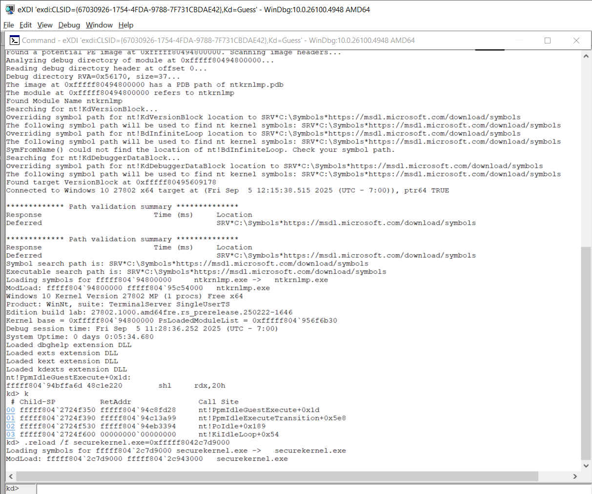
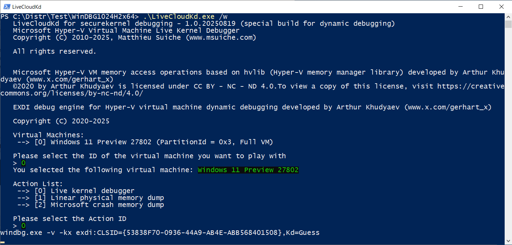
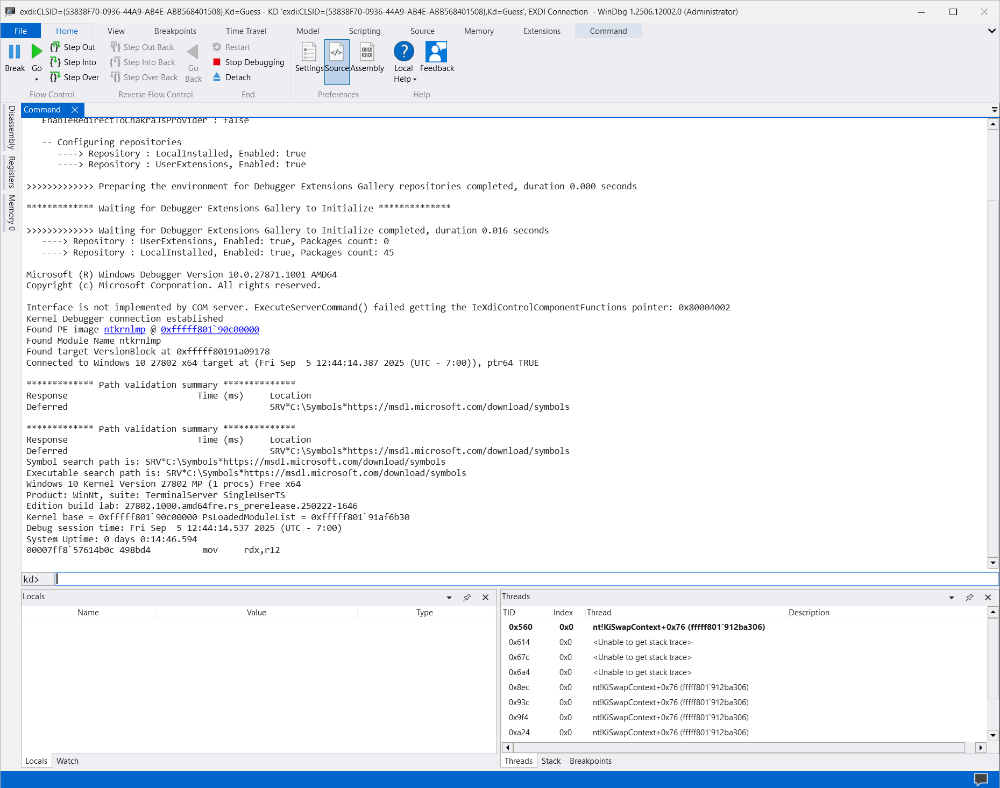

This project is modified EXDI plugins example from WinDBG SDK
(C:\Program Files (x86)\Windows Kits\10\Debuggers\x64\sdk\samples\exdi\ExdiKdSample)

It uses Hyper-V memory manager library for reading and writing memory operations and other operations with Hyper-V CPU

There is readme.docx in ExdiKdSample project in WinDBG SDK directory, which describes architecture of EXDI interface. If shortly,
EXDI is an interface, that allows extending WinDBG by adding support for hardware debuggers. At the time of starting development that debug engine, there is no hardware debuggers for Hyper-V, but we can add hvlib.dll functions calling to EXDI interface.

For installation: 

1. Copy LiveCloudKd.exe, hvlib.dll, hvmm.sys and ExdiKdSample.dll to WinDBG x64 directory
2. Register ExdiKdSample.dll using regsvr32.exe ExdiKdSample.dll command
3. Start LiveCloudKd with /w option: LiveCloudKd.exe /w. It is automatically launch WinDBG with EXDI interface.



You can use WinDBG or WinDBG (Classic) with EXDI plugin

1. Launch LiveCloudKd.exe /x.
2. Copy string, which provided by LiveCloudKd. 



3. Start WinDBG, go to File -> Start debugging -> Attach to Kernel, open EXDI tab and paste string 
```
exdi:CLSID={53838F70-0936-44A9-AB4E-ABB568401508},Kd=Guess
```
to field or execute

```
DbgX.Shell.exe -v -kx exdi:CLSID={53838F70-0936-44A9-AB4E-ABB568401508},Kd=Guess or
.\DbgX.Shell.exe -v -kx "exdi:CLSID={53838F70-0936-44A9-AB4E-ABB568401508},Kd=Guess" or
windbgx -v -kx "exdi:CLSID={53838F70-0936-44A9-AB4E-ABB568401508},Kd=Guess"
```


1. You can read\write to guest OS memory and execute WinDBG commands, that work for dump files. Remember, that it is static plugin example, and you can't do single-step (F11, F8) or running live debugging commands in that plugin.



Detailed information about EXDI live debugging you can find on [this page](LiveDebugging.md)
