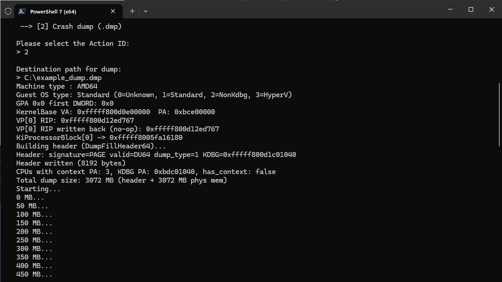

# livecloudkd-example

Rust port of the C example from `LiveCloudKdExample\LiveCloudKdExample.c`.

Demonstrates the full `hvlib.dll` API surface using the [`livecloudkd`](../LiveCloudKdRs) crate:



1. Enumerate running Hyper-V partitions (name, partition ID, GUID)
2. Interactive VM and action selection
3. Query guest OS type
4. Read 4 bytes from guest physical address 0 (GPA)
5. Translate `ntoskrnl` base address VA → PA
6. Read virtual-processor register RIP (VP 0, VTL 0)
7. Write the same RIP value back (no-op demo)
8. Read guest virtual memory at `KiProcessorBlock`
9.  Suspend and immediately resume the VM
10. *(optional)* Dump all guest physical memory to a raw file in 1 MB blocks

## Requirements

- Windows host with Hyper-V and at least one running VM
- Administrator privileges
- `hvlib.dll` and `hvmm.sys` copied next to the binary (see below)
- Rust toolchain `stable-x86_64-pc-windows-msvc`

## Build

```
cd C:\Projects\LiveCloudKd
cargo build --release -p livecloudkd-example
```

## Run

Copy the runtime files next to the compiled binary, then run as Administrator:

```
copy LiveCloudKdSdk\files\hvlib.dll  target\release\
copy LiveCloudKdSdk\files\hvmm.sys   target\release\

target\release\livecloudkd-example.exe
```

## Example session

```
Virtual Machines:
 --> [0] Windows Server 2025 (PartitionId = 0x2, Full VM, GUID: 46880784-...)

Please select the ID of the virtual machine:
> 0
Selected: Windows Server 2025

Action List:
 --> [0] Demo only (no file output)
 --> [1] Linear physical memory dump

Please select the Action ID:
> 0

Machine type : AMD64
Guest OS type: Standard (0=Unknown, 1=Standard, 2=NonKdbg, 3=HyperV)
GPA 0x0 first DWORD: 0x0
KernelBase VA: 0xfffff80376200000  PA: 0xbce00000
VP[0] RIP: 0xfffff803766eda17
VP[0] RIP written back (no-op): 0xfffff803766eda17
KiProcessorBlock[0] -> 0xfffff80305c9c180
Suspending VM...
Resuming VM...
```

With action `1` and a destination path, a raw physical memory image is written:

```
PageCountTotal = 0xc0000
Total size:     3072 MB
Starting dump...
0 MB... 50 MB... ... 3050 MB...
Done.
```

The resulting `.raw` file can be opened directly in WinDbg, Volatility, or any
tool that accepts a flat physical memory image.
