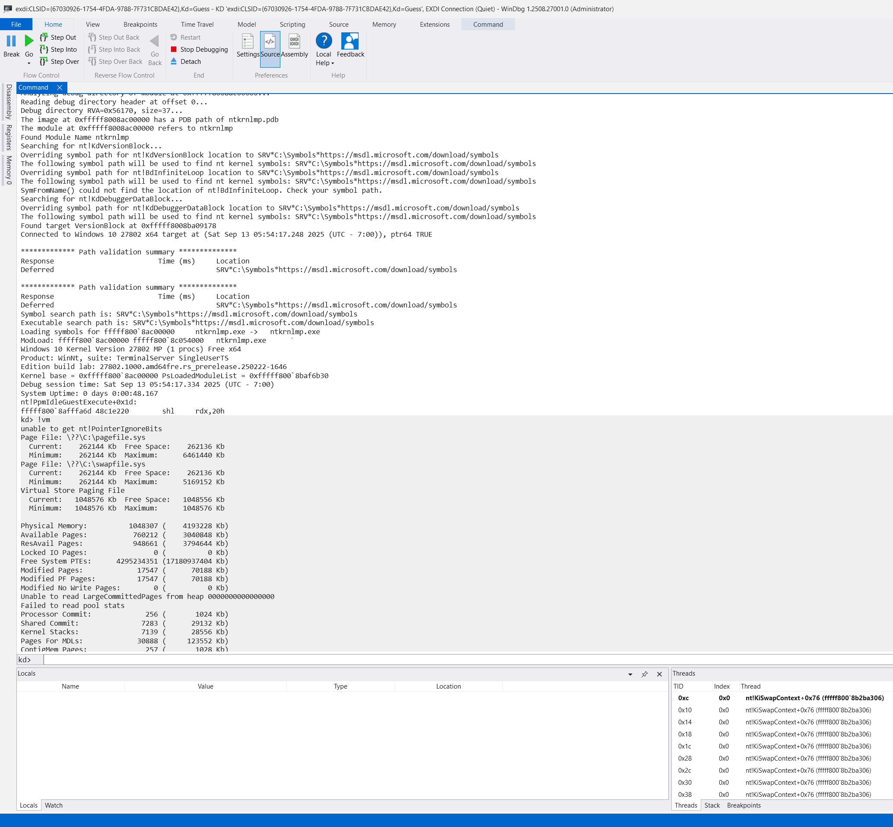

This is a fork of LiveCloudKd, which was early developed by Matt Suiche [(www.msuiche.com)](https://www.msuiche.com): https://github.com/msuiche/LiveCloudKd.

## LiveCloudKd (2025)

LiveCloudKd is a tool, that allows you to connect to a Hyper-V guest VM with kd.exe (or WinDBG and WinDBG with a modern UI). 

Also, you can use the LiveCloudKd EXDi plugin for attaching to Hyper-V VM.  

The tool uses Hyper-V Memory Manager plugin for operations with Hyper-V memory.
The tool has additional options in comparison with LiveKd from Microsoft Sysinternals Suite:

1. Write capabilities (you can write to Hyper-V VM in virtual and physical address space using native WinDBG commands or Hvlib API)
2. More performance
3. Support Hyper-V VM with nested option enabled on Intel-based CPU
4. Support multilingual OS

LiveCloudKd. [Download](https://github.com/gerhart01/LiveCloudKd/releases/download/v2.8.4.20241221/LiveCloudKd.v2.8.4.20241221-release.zip)  
Contains EXDI plugin for static dump view:    

  
  

LiveCloudKd is based on the hvlib.dll library (Hyper-V Memory Manager plugin). Other tools, that were developed using this library:

LiveCloudKd EXDi debugger. [Download](https://github.com/gerhart01/LiveCloudKd/releases/download/v1.0.22021109/LiveCloudKd.EXDi.debugger.v1.0.22021109.zip). [Readme](https://github.com/gerhart01/LiveCloudKd/blob/master/ExdiKdSample/LiveDebugging.md)  
Hyper-V Virtual Machine plugin for MemProcFS. [Download](https://github.com/gerhart01/LiveCloudKd/releases/download/v1.5.20241221/leechcore_hyperv_plugin_21.12.2024.zip)  
Hyper-V Memory Manager plugin for volatility. [Download](https://github.com/gerhart01/Hyper-V-Tools/releases/download/v1.0.20240427/Hyper-V.Memory.Manager.plugin.for.volatility.v1.0.20240427.zip)  
HyperViews. [Download](https://github.com/gerhart01/Hyper-V-Tools/tree/main/HyperViews)  

Also SDK for working with Hyper-V memory is available
Hyper-V Memory Manager module for Powershell. [Link](https://github.com/gerhart01/Hyper-V-Tools/tree/main/HvlibPowershell)  
Hyper-V Memory Manager module for Python. [Link](https://github.com/gerhart01/LiveCloudKd/tree/master/LiveCloudKdPy)  
Hyper-V Memory Manager module for C#. [Link](https://github.com/gerhart01/LiveCloudKd/tree/master/hvlibdotnet)  
Hyper-V Memory Manager library API for C. [Link](https://github.com/gerhart01/LiveCloudKd/tree/master/LiveCloudKdSdk)  

Methods for accessing guest Hyper-V VM memory: 
```
 ReadInterfaceWinHv - uses Hyper-V hypercall for reading guest OS memory. Slow, but robust method; 
 ReadInterfaceHvmmDrvInternal - read data directly from kernel memory. Faster, than ReadInterfaceWinHv, but uses undocumented structures). The default reading method is ReadInterfaceHvmmDrvInternal.

 WriteInterfaceWinHv - uses Hyper-V hypercall for writing to guest OS memory.
 WriteInterfaceHvmmDrvInternal - write data directly to kernel memory. Faster, than WriteInterfaceWinHv, but uses undocumented structures). The default writing method is WriteInterfaceHvmmDrvInternal.
```
Also  ReadInterfaceLocal - read data from local operation system (not Hyper-V) is available  

LiveCloudKd was tested on 
```
Windows Server 2025
Windows Server 2022 
Windows Server 2019  
Windows Server 2016 
Windows 11
Windows 10
```

and some preview versions of Windows 11 and Windows Server vNext

Configure symbol path:

``` 
mkdir C:\Symbols
compact /c /i /q /s:C:\Symbols
setx /m _NT_SYMBOL_PATH SRV*C:\Symbols*https://msdl.microsoft.com/download/symbols
```

For launch:

1. Extract LiveCloudKd.exe, hvlib.dll, hvmm.sys to WinDBG x64 folder (tested on WinDBG from WDK 1809 - 24H2) or separate folder (use /y key for specifying directory with WinDBG). 
    Also, LiveCloudKd can find a path to WinDBG, if it was installed with Windows WDK or SDK.
2. Launch LiveCloudKd.exe with local administrator privileges (It needs Visual Studio 2022 runtime libraries - https://aka.ms/vs/17/release/vc_redist.x64.exe).
3. Choose a Hyper-V virtual machine or local Windows for representation to WinDBG as dump file.  

LiveCloudKd searches WinDBG in the next steps:


1. Directory, which specifying with /y parameter.

```
LiveCloudKd /y C:\Microsoft\WinDBG
```
2. Windows Registry HKLM\Software\LiveCloudKd\Parameters\WinDbgPath key. See RegParam.key for instance. 
3. Standard Windows SDK\WDK installation folder (used registry key for search that path).
4. If the previous result is not successful, LiveCloudKd tries to run kd.exe from the same folder.

Performance comparison with LiveKd from Sysinternals Suite (LiveCloudKd is more performance: about 1000 times using ReadInterfaceHvmmDrvInternal interface):


LiveCloudKd options:

``` 
 /a         Pre-selected action.
                  0 - Live kernel debugging
                  1 - Start EXDi plugin (WinDBG)
                  2 - Produce a linear physical memory dump
                  3 - Produce a Microsoft full memory crash dump
                  4 - Dump guest OS memory chunk
                  5 - Dump RAW guest OS memory (without KDBG scanning)
                  6 - Resume VM
 /b         Close LiveCloudKd automatically, after exiting from kd or WinDBG.
 /f         Force freeze CPU on every read operation. It is actually for Windows Sandbox because it constantly resumes CPU.
 /m         Memory access type.
                  0 - Winhvr.sys interface
                  1 - Raw memory interface (hvmm.sys)
                  2 - Local OS
 /n         Pre-selected number of VM.
 /o         Destination path for the output file (Action 2 - 5).
 /p         Pause partition.
 /v         Verbose output.
 /w         Run WinDBG instead of Kd (Kd is the default).
 /y         Set path to WinDBG or WinDBG with modern UI (for start EXDI plugin)
 /?         Print this help.
``` 

EXDI module can get instructions for writing some bytes to Hyper-V virtual machine memory from WinDBG engine (depending on WinDBG or WinDBGX version), therefore writing memory capabilities are disabled by default.
To enable it enter the command:

```
wrmsr 0x1112 1
```

disable
```
wrmsr 0x1112 0
```

Project uses diStorm3 library (BSD license) by [Gil Dabah](https://twitter.com/_arkon): [Distorm project](https://github.com/gdabah/distorm)
